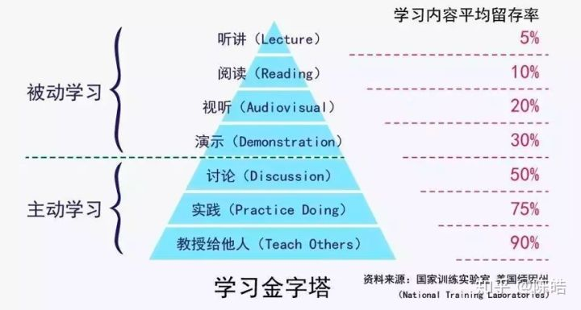

## Algorithm

LeetCode: 1207 simple

方法一: 首先我自己想到的方法

​	先使用map进行数组出现的元素进行统计个数, 然后将出现的次数存放到一个数组里,然后再进行快排, 再进行快慢指针判断是否存在重复的元素.	

```go
//map[2:7 5:4 16:7 17:1 20:6 26:3]  2和16都出现7次,就不是独一无二
//时间复杂度O(NlogN),空间复杂度:O(n)
//思路: 先使用map进行数组出现的元素进行统计个数, 然后将出现的次数存放到一个数组里,
// 然后再进行快排, 再进行快慢指针判断是否存在重复的元素.
func UniqueOccurrences(arr []int) bool {
	if len(arr) == 0 || len(arr) == 1 {
		return false
	}
	have := make(map[int]int)
	for _, v := range arr {
		if _, ok := have[v]; ok {
			have[v] ++
		} else {
			have[v] = 1
		}
	}
	lst := make([]int, len(have))
	i := 0
	for _, cnt := range have {
		lst[i] = cnt
		i ++
	}

	quickSort(lst, 0, len(lst)-1)
	//fmt.Println(lst)
	for i := 0; i < len(lst) - 1;i ++ {
		//fmt.Printf("arr[%d]=%d, arr[%d]=%d\n", i, lst[i], i+1, lst[i+1])
		if lst[i] == lst[i+1] {
			return false
		}
	}
	return true
}
func quickSort(arr []int, left, right int) {
	pivot := arr[left]
	i, j := left, right
	for i < j {
		for i < j && pivot <= arr[j] {
			j --
		}
		arr[i] = arr[j]
		for i < j && pivot >= arr[i] {
			i ++
		}
		arr[j] = arr[i]
	}
	arr[i] = pivot
	if i - left > 1 {
		quickSort(arr, left, i - 1)
	}
	if right - i > 1 {
		quickSort(arr, i + 1, right)
	}
}
```

方法二: 看了别人的解, 借用2个map实现

```go
func uniqueOccurrences(arr []int) bool {
    if len(arr) == 0 || len(arr) == 1 {
		return false
	}
    //先统计数字出现的次数
    have := make(map[int]int)
    for _, v := range arr {
        have[v] ++
    }
    //然后将出现次数进行map判断, 是否有重复的.
    cntHave := make(map[int]int) 
    for _, cnt := range have {
        cntHave[cnt] ++
    }
    //判断是否有重复, 若重复则数量大于1
    for _, count := range cntHave {
        if count != 1 {
            return false
        }
    }
    return true
}
```


## Review

https://docs.huihoo.com/go/golang.org/doc/effective_go.html

1. Effective 有效的
2. Although /ɔːlˈðoʊ/ 尽管


## Tip


# share

### 学习的金字塔



听别人讲, 自己看书, 看视频, 都不是真正获得学习的能力, 因为这些都被动的.被人灌输的.

只有自己在听, 看时进行**思考, 总结, 归纳**, 找别人交流讨论, 开始实践并对外输出自己学到的知识, 并教会别人, 自己才真正掌握到知识与学习能力.

学习不是努力读更多的书,这会让人产生底层次的勤奋和成长的感觉. 

读书必须做笔记,必须思考这个知识, 并进行总结, 归纳成系统, 才能真正获取知识.